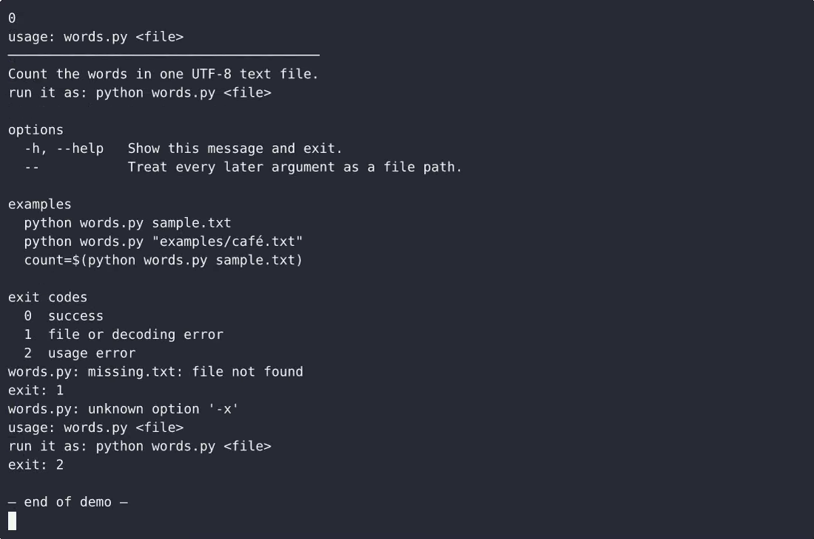

# wordcount-cli — complete Full-stack app command-line tool example app

Most open-source command-line tool projects ship a skeleton. **wordcount-cli** ships the whole thing: production-ready Full-stack app source, seeded demo data, and a wordcount-cli install script that runs in minutes. Build a single-file Python 3 CLI, words.py, that prints how many whitespace-separated words a given file contains and fails cleanly (message on stderr, non-zero exit, no traceback) when the argument is missing or the…. Apache-2.0-licensed — [remix wordcount-cli on cenius.ai](https://cenius.ai/marketplace/p/wordcount-cli-4?ref=gh&utm_campaign=wordcount-cli-webapp-4) for your own branded build.


[](LICENSE)  [](https://cenius.ai)

[](https://cenius.ai/marketplace/p/wordcount-cli-4?ref=gh&utm_campaign=wordcount-cli-webapp-4)

> **▶ [Open & edit in cenius.ai](https://cenius.ai/marketplace/p/wordcount-cli-4?ref=gh&utm_campaign=wordcount-cli-webapp-4)** — one click to an editable workspace: describe changes in plain English, get an instant preview, one-click deploy and host. Modifications made on the platform come with full rebrand & relicense rights.

_Local clone? See [Quick start](#quick-start) below. cenius.ai is the zero-setup path._

## Demo


▶ **[See it in action](https://cenius.ai/marketplace/p/wordcount-cli-4?ref=gh&utm_campaign=wordcount-cli-webapp-4)** — full demo on the project page · [MP4](.github/media/demo.mp4)

## Screenshots

 

## Quick start

```bash
./install.sh   # installs dependencies + seeds demo data
```

See [`INSTALL.md`](INSTALL.md) for full setup and usage instructions.

## Features

- Count words in a file
- Clear errors and exit codes for bad invocations

## Architecture

Kick off `./install.sh` to pull packages and seed the database, then the app is up. The Full-stack app codebase (26 files) is self-contained — no external services needed to evaluate it. Top-level layout: `examples/`. See [`INSTALL.md`](INSTALL.md) for complete setup instructions.

## Usage guide

Walkthroughs of what `words.py` actually does. Every command below was run
against this checkout.

### Count a file

```console
$ python3 words.py sample.txt
30
$ echo $?
0
```

One integer, one newline, nothing else, and nothing on stderr.

### Count a non-ASCII UTF-8 file

```console
$ python3 words.py examples/café.txt
3
```

The file is opened as UTF-8 explicitly, so the result does not depend on the
machine's locale:

```console
$ LC_ALL=C python3 words.py examples/café.txt
3
```

### Empty and whitespace-only files

```console
$ python3 words.py examples/empty.txt
0
$ python3 words.py examples/whitespace.txt
0
```

### Help

```console
$ python3 words.py --help
usage: words.py <file>
───────────────────────────────────────
Count the words in one UTF-8 text file.
run it as: python words.py <file>

options
  -h, --help   Show this message and exit.
  --           Treat every later argument as a file path.

examples
  python words.py sample.txt
  python words.py "examples/café.txt"
  count=$(python words.py sample.txt)

exit codes
  0  success
  1  file or decoding error
  2  usage error
```

`-h` prints exactly the same text on stdout and exits 0. A help flag wins over a
path, so `python3 words.py --help bogus.txt` still exits 0 and reads no file.

### Feed the count to something else

```console
$ python3 words.py sample.txt | wc -l
1
$ count=$(python3 words.py sample.txt); echo "$count words"
30 words
```

### Failures, one line each

```console
$ python3 words.py missing.txt
words.py: missing.txt: file not found
$ echo $?
1

_Full guide: [`USAGE.md`](USAGE.md)_

## FAQ

### How do I run wordcount-cli on my own server?

Grab the repo and run `./install.sh` — it handles packages and seed data in one go. After that, [`INSTALL.md`](INSTALL.md) walks you through starting the server. No external accounts required.

### What powers wordcount-cli under the hood?

Full-stack app end-to-end. Every file you need to run the app is here in this repository — code, configuration, seed data. Highlights include clear errors and exit codes for bad invocations.

### Is wordcount-cli free for commercial use?

Yes. The code is Apache-2.0-licensed — use it, modify it, and ship it commercially. See [LICENSE](LICENSE).

### How do I customise wordcount-cli's branding?

Yes. The MIT license lets you remove the original branding and ship under your own name. For a guided approach, [remix it on cenius.ai](https://cenius.ai/marketplace/p/wordcount-cli-4?ref=gh&utm_campaign=wordcount-cli-webapp-4): you get a fresh build with full rebrand and relicense rights.

### Is there a no-code way to modify wordcount-cli?

Describe what you want changed on [cenius.ai](https://cenius.ai/marketplace/p/wordcount-cli-4?ref=gh&utm_campaign=wordcount-cli-webapp-4) — no code editing needed; the platform produces a fresh build you can download and deploy.

## License & rebranding

Released under the [Apache License 2.0](LICENSE) (© 2026 Cenius AI) — free for personal and commercial use. The Cenius name/logo are trademarks (see NOTICE).

**Need a customized version?** [Remix this app on cenius.ai](https://cenius.ai/marketplace/p/wordcount-cli-4?ref=gh&utm_campaign=wordcount-cli-webapp-4) — modifications made on the platform come with **full rebrand & relicense rights** over your derivative.

## Built with cenius.ai

This entire application — code, design, seeded demo data — was generated on **[cenius.ai](https://cenius.ai)** from a plain-English description.

- 🚀 [Build your own app on cenius.ai](https://cenius.ai)
- 🎛️ [Remix wordcount-cli on the marketplace](https://cenius.ai/marketplace/p/wordcount-cli-4?ref=gh&utm_campaign=wordcount-cli-webapp-4) — open it in a workspace, prompt for changes, and ship your own version.

More open-source apps: [the Cenius-ai catalog](https://github.com/Cenius-ai) · [showcase index](https://github.com/Cenius-ai/showcase)
